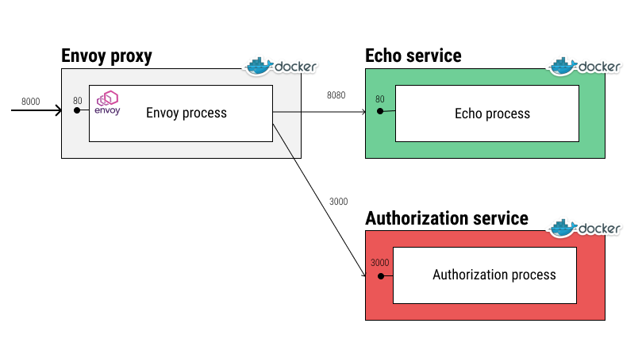

  

# Envoy External Authorization

## Build

```bash
docker-compose build
```

## Run

```bash
docker-compose up
```

## Test

Current setup allows only requests with `User-Agent: Chrome` header, with other `User-Agent` headers the request will be rejected with `403` status code.

**Not allowed** (403):

```bash
curl -v -A "sfjs" http://localhost:8000
```

**Allowed** (200) we will get the response from the echo service [http-echo](https://hub.docker.com/r/solsson/http-echo):

```bash
curl -v -A "Chrome" http://localhost:8000
```

## How it works



Uses three containers:

1. [Envoy proxy](Dockerfile-proxy)
2. [External authorization service](Dockerfile-auth-service)
3. [Service (http-echo)](Dockerfile-web-echo)

Requests flow:

1. The client sends a request to the Envoy proxy.
2. The Envoy proxy forwards the request to the external authorization service.
3. The external authorization service checks the `User-Agent` header and returns `200` if the header contains the `Chrome` string.
4. The Envoy proxy forwards the request to the service if the external authorization service returns `200`.
5. The service returns the response to the client.
If the external authorization service returns a different status code (e.g., `403`), the Envoy proxy returns the status code to the client without forwarding the request to the service.

## Configuration

- Envoy proxy configuration: [envoy.yaml](./envoy.yaml)
